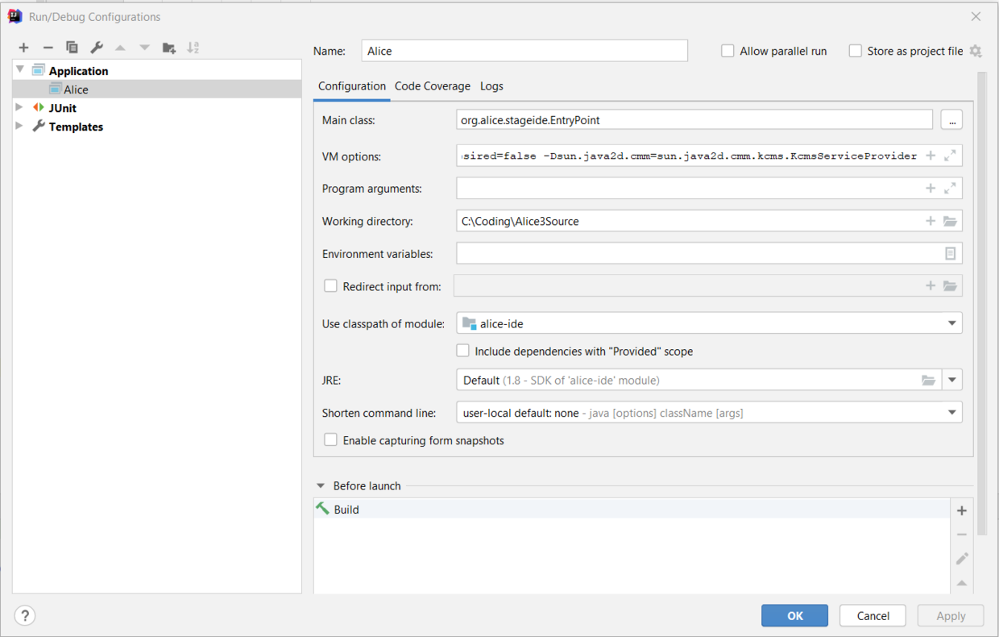

# Alice 3

[Alice](https://www.alice.org) is an innovative block-based programming environment that makes it easy to create animations, build interactive narratives, or program simple games in 3D.

### Latest Released Build:

## Building Alice 3 from the source

Download and install the following build tools
* [Java 17](https://www.oracle.com/java/technologies/downloads/#JDK17)
  * Set $JAVA_HOME accordingly, and add $JAVA_HOME/bin to your PATH
* [Apache Maven](https://maven.apache.org/install.html) 3.6.3 or later
* git
* [git-lfs](https://help.github.com/en/articles/installing-git-large-file-storage)
* [Install4J 9](https://www.ej-technologies.com/products/install4j/overview.html) (Only required to build the installers)

---

Clone the Alice 3 repository into a local directory, `${alice3}`

    cd ${alice3}
    git clone --recurse-submodules https://github.com/TheAliceProject/alice3.git
    
Alice 3 uses a submodule for the Tweedle language, the internal representation of Alice code.
If you do not use the `--recurse-submodules` flag above it can be pulled in explicitly.

    git submodule init
    git submodule update

To ensure the lfs files are available locally:

    git lfs pull 

Compile and jar the Alice code.

    mvn compile

or, to also build the NetBeans plugin:

    mvn -Dinstall4j.skip install

And, if you want to use Install4J to build the installers:

        mvn install

## Executing, testing, and building

After successfully compiling, you can launch the Alice IDE

    cd alice-ide
    mvn exec:java -Dentry-point

Run unit tests

    cd ${alice3}
    mvn test

Build the Alice installers, which  requires Install4J 7:

    cd ${alice3}
    mvn install

## IDE
**IntelliJ IDEA** is suggested for coding/building Alice 3. There is a free community edition
or JetBrains offers a product pack for students using an edu email address [here](https://www.jetbrains.com/community/education/#students
).

### Build with IntelliJ

**Alice 3 builds with Java 17** which should be installed and selected in place of IntelliJ's bundled JDK.

IntelliJ IDEA has a bundled maven.
* The location is set in:
  * *File -> Settings -> Build, Execution, Deployment -> Build Tools -> Maven*
* To build with maven using **build project** in the IDE first check the "Delegate IDE build/run actions to Maven" option in
  * *File -> Settings -> Build, Execution, Deployment -> Build Tools -> Maven -> Runner*

### Run with IntelliJ
After the project is built successfully. You can create a Run/Debug Configuration and run the project.
In the **Run/Debug Configurations** window, create a new **Application** configuration and enter lines as bellow.

The working directory should be the root directory where you checked the Alice 3 project out, `${alice3}`.

The VM options are:

    -ea
    -splash:"./core/resources/target/distribution/application/SplashScreen.png"
    -Xmx1024m
    -Dswing.aatext=true
    -Dorg.alice.ide.rootDirectory="./core/resources/target/distribution"
    -Dcom.apple.mrj.application.apple.menu.about.name=Alice3
    -Dedu.cmu.cs.dennisc.java.util.logging.Logger.Level=WARNING
    -Dorg.alice.ide.internalTesting=true
    -Dorg.lgna.croquet.Element.isIdCheckDesired=true
    -Djogamp.gluegen.UseTempJarCache=false
    -Dorg.alice.stageide.isCrashDetectionDesired=false
    -Dsun.java2d.cmm=sun.java2d.cmm.kcms.KcmsServiceProvider
    --add-opens=java.base/java.io=ALL-UNNAMED
    --add-opens=java.desktop/sun.awt=ALL-UNNAMED
    --add-opens=java.base/java.time=ALL-UNNAMED

Then the project should be ready to run.

Final note: If you were delegating IDE build/run actions to Maven in the previous step, please uncheck that option. Or you might run into some graphics errors running Alice.

## Working without the Sims*

The compile, package, and install phases can all be limited to not include the Sims assets.
To do that disable the `includeSims` maven profile.

It is a good idea to `clean` if you have previously made a full build.
This may prevent leftover Sims artifacts getting bundled in.

    cd ${alice3}
    mvn -DincludeSims=false -Dinstall4j.skip clean package
Or:

    cd ${alice3}
    mvn -DincludeSims=false clean install

**This is still experimental, so there may be errors.*

## How to contribute

We appreciate contributions from the Alice community.

To make it easier to merge in new work, when submitting PRs please:
* Keep each one small and focused
* Make individual commits of smaller chunks with clear descriptions
* Follow the established coding style

### Development tools

This repository previously included a number of projects that were experiments, test beds, and development aids.

They have been relocated to the [Alice 3 Tools](https://github.com/TheAliceProject/alice3-tools) repo.
(NB If you are looking for historic versions of any of those projects, the richer git history is in this repo. The history did not migrate due to the way filter-branch was applied.)
